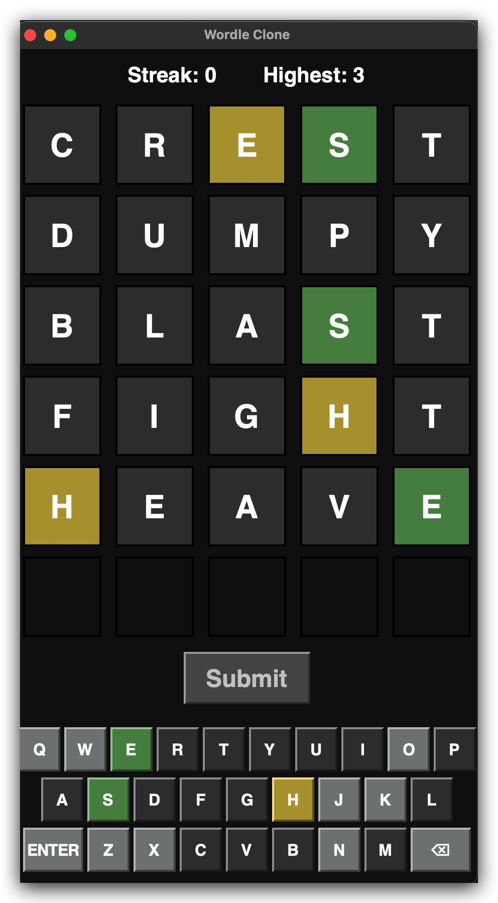
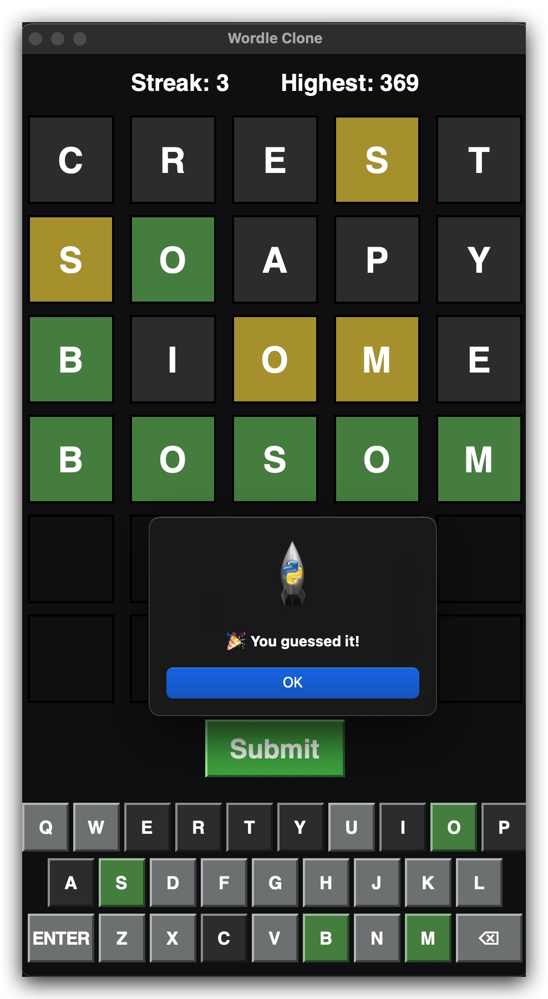

# 🎯 PyWordle

A clean, fun, and fully customizable clone of the classic **Wordle** game — built with Python!  
Challenge yourself daily, explore endless words, and tweak the rules to make the game your own.

---

## 🚀 Features

- 🟩 Play unlimited Wordle-style games in Python
- 📜 Uses a clean and sensible English word list
- 🎨 Easy customization of word lists and difficulty
- 💻 Runs in your terminal (lightweight & fast!)
- 📊 Tracks stats across multiple games

---

## 🖼️ Screenshots


<p align="center">
  
  
</p>

---

## ⚡ Installation

Clone the repo:

```bash
git clone git@github.com:Blues1998/PyWordle.git
cd PyWordle
```

Run the game:

```bash
python main.py
```

---

## 📚 How to Play

- Guess the hidden word in **6 tries**.  
- Letters change color to show how close your guess was:  
  - 🟩 Green = Correct letter, correct spot  
  - 🟨 Yellow = Correct letter, wrong spot  
  - ⬜ Gray = Letter not in the word  

---

## 🔧 Customization

You can replace or expand the word list in `words.txt` with your own set of words.  
Perfect for theme-based games (animals, programming terms, etc.)!

---

## 🤝 Contributing

Pull requests are welcome! If you'd like to suggest features or fix issues, feel free to open an issue first to discuss.

---

## 📜 License

MIT License © 2025 [Animesh Singh]

---

✨ Have fun guessing, and may the 🟩's be ever in your favor!
